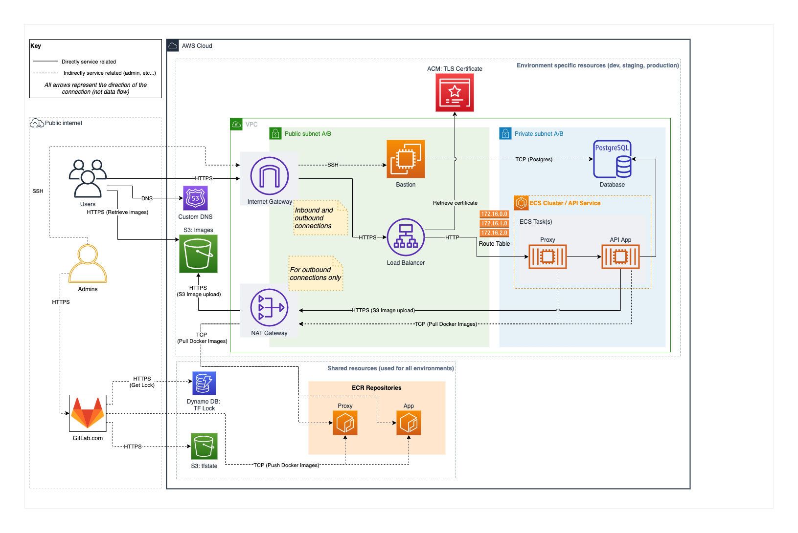

# DevOps Course Notes

Diagram of services used.
## SSH Authentication
SSH keys are used to create secure connections between local machines and remote servers. Private keys are stored on the computer and are never shared, public keys are shared with the external servers. The public key matches with the private key to establish the connection.

### Create SSH Key Pair
In terminal:
```sh
ssh-keygen -t rsa -b 4096 -C "[name of key]"
```
`-t`: type of rsa  
`-b`: size of 4096 bytes  
`-C`: "comment", or name of key (ex: isaac@mbp) 

This creates a new ssh key in directory `~/.ssh`. Retrieve contents of public key with:
```sh
cat ~/.ssh/[file].pub
```

## AWS Terms
* **IAM**: sub user of account, should only contain permissions necessary to user's role.
* **Group**: Group of users, has default permissions
* **AWS-Vault**: local software provided by aws to securely authenticate and connect to your account. It should connect via IAM user. Keeps a connection open for a certain duration. Credentials are stored via Mac's keychain.
* **ARN**: long string representing a key, used to authenticate different services between each other.
* **Budget**: setting in aws that allows user to define different spending thresholds. Threshold will not stop spending, but will notify user when reached.
* **ECR**: Elastic Container Registry, service in aws to store docker images
* **S3**: Simple Storage Service, a file storage system meant for software
* **DynamoDB**: no SQL storage solution for simply storing files or state
* **EC2** / **Bastion**: EC2 is a virtual machine used to create a bastion server, a bastion server is used to connect to a private network for admin purposes
* **RDS**: Relational Database Service, service used to create databases in AWS
* **ECS**: Elastic container sevice, used to run docker container for the app
* **Cloudwatch**: Used to monitor logs for application

## AWS Account Setup
It is important to always use an IAM user when managing settings, and to always have MFA setup on both root and IAM accounts.
### Setup Users / Groups
1. Go to Billing, scroll down and activate IAM access to Billing Info.
2. To create policy to enable MFA by default: 
    - Go to IAM > Policies > Create Policy
    - Insert following JSON:
    ``` json
    {
        "Version": "2012-10-17",
        "Statement": [
            {
                "Sid": "AllowViewAccountInfo",
                "Effect": "Allow",
                "Action": [
                    "iam:GetAccountPasswordPolicy",
                    "iam:GetAccountSummary",
                    "iam:ListVirtualMFADevices",
                    "iam:ListUsers"
                ],
                "Resource": "*"
            },
            {
                "Sid": "AllowManageOwnPasswords",
                "Effect": "Allow",
                "Action": [
                    "iam:ChangePassword",
                    "iam:GetUser"
                ],
                "Resource": "arn:aws:iam::*:user/${aws:username}"
            },
            {
                "Sid": "AllowManageOwnAccessKeys",
                "Effect": "Allow",
                "Action": [
                    "iam:CreateAccessKey",
                    "iam:DeleteAccessKey",
                    "iam:ListAccessKeys",
                    "iam:UpdateAccessKey"
                ],
                "Resource": "arn:aws:iam::*:user/${aws:username}"
            },
            {
                "Sid": "AllowManageOwnSigningCertificates",
                "Effect": "Allow",
                "Action": [
                    "iam:DeleteSigningCertificate",
                    "iam:ListSigningCertificates",
                    "iam:UpdateSigningCertificate",
                    "iam:UploadSigningCertificate"
                ],
                "Resource": "arn:aws:iam::*:user/${aws:username}"
            },
            {
                "Sid": "AllowManageOwnSSHPublicKeys",
                "Effect": "Allow",
                "Action": [
                    "iam:DeleteSSHPublicKey",
                    "iam:GetSSHPublicKey",
                    "iam:ListSSHPublicKeys",
                    "iam:UpdateSSHPublicKey",
                    "iam:UploadSSHPublicKey"
                ],
                "Resource": "arn:aws:iam::*:user/${aws:username}"
            },
            {
                "Sid": "AllowManageOwnGitCredentials",
                "Effect": "Allow",
                "Action": [
                    "iam:CreateServiceSpecificCredential",
                    "iam:DeleteServiceSpecificCredential",
                    "iam:ListServiceSpecificCredentials",
                    "iam:ResetServiceSpecificCredential",
                    "iam:UpdateServiceSpecificCredential"
                ],
                "Resource": "arn:aws:iam::*:user/${aws:username}"
            },
            {
                "Sid": "AllowManageOwnVirtualMFADevice",
                "Effect": "Allow",
                "Action": [
                    "iam:CreateVirtualMFADevice",
                    "iam:DeleteVirtualMFADevice"
                ],
                "Resource": "arn:aws:iam::*:mfa/${aws:username}"
            },
            {
                "Sid": "AllowManageOwnUserMFA",
                "Effect": "Allow",
                "Action": [
                    "iam:DeactivateMFADevice",
                    "iam:EnableMFADevice",
                    "iam:ListMFADevices",
                    "iam:ResyncMFADevice"
                ],
                "Resource": "arn:aws:iam::*:user/${aws:username}"
            },
            {
                "Sid": "DenyAllExceptListedIfNoMFA",
                "Effect": "Deny",
                "NotAction": [
                    "iam:CreateVirtualMFADevice",
                    "iam:EnableMFADevice",
                    "iam:GetUser",
                    "iam:ListMFADevices",
                    "iam:ListVirtualMFADevices",
                    "iam:ResyncMFADevice",
                    "sts:GetSessionToken",
                    "iam:ListUsers"
                ],
                "Resource": "*",
                "Condition": {
                    "BoolIfExists": {
                        "aws:MultiFactorAuthPresent": "false"
                    }
                }
            }
        ]
    }

    ```
    - Give it name, description, create.
3. Create group by going to Groups > Create Group.
    - For admin user, select `AdministratorAccess` policy and newly created MFA policy.
4. To create IAM user, go to Users > Add User. Add name, select console access. Add to Group.
5. Save account ID. Log in as new IAM user (or whoever new account is for), and enter account id, username, password. Set up MFA. Log out, then log in again for full permissions.

### Set up AWS-Vault
1. In IAM account, go to IAM > Users > Security Credentials, create new Access Key. (Leave success dialog/window open to copy private key)
2. With aws-vault installed (using brew), enter following command
```sh
aws-vault add [username of IAM user]
```
Enter Access key and private key when prompted. This will create a new vault on mac, enter new password for that as well (if prompted).
3. Set up MFA for console by editing the config file. Access file by following command:
```sh
vim ~/.aws/config
```
Then add the following to file:
```
region=us-east-1
mfa_serial=[ARN for MFA device]
```
Find the ARN for the device in IAM > Users > Security Credentials, make sure to select the correct key - it should be in a section labeled Assigned MFA Device (or something similar). 
4. Enable secure session with the following command:
```sh
aws-vault exec [username] --duration=12h
```
Duration can be configured for any amount of hours up to 12.

### Create AWS Budget (optional)
Creating an budget will tell AWS to notify the user via email when a budget threshold is reached. It is possible to go past this threshold.

1. Go to Billing > Budgets, create custom cost budget. 
2. Name it, set it to monthly, make it fixed, and set the budget amount.
3. Create alerts to enable users when account has used up to certain amount of budget.


## Setup NGINX Proxy
Proxy servers exist to help django serve static files. It acts as a web server to make it more effecient to serve these files.

### Steps:
1. create new GitLab project
2. disable public pipelines, add protected branch `*-release` to ensure all branches flagged as `-release` are only able to be created/modified by certain users (maintainers). Add `*-release` to list of protected tags.
3. clone project via ssh to local. Passphrase is needed if it's set.
4. create new ECR repo, this is where the dynamic containers will be created. Enable `scan on push`.
5. Create a custom aws policy with the json below:
```json
{
    "Version": "2012-10-17",
    "Statement": [
        {
            "Effect": "Allow",
            "Action": [
                "ecr:*"
            ],
            "Resource": "arn:aws:ecr:us-east-1:*:repository/recipe-app-api-proxy"
        },
        {
            "Effect": "Allow",
            "Action": [
                "ecr:GetAuthorizationToken"
            ],
            "Resource": "*"
        }
    ]
}
```
6. create a new IAM user with the newly created policy, this will be the "user" that is used for dynamic ECR tasks. Create access key.
7. create the following protected/masked variables in gitlab:
    * AWS_ACCESS_KEY
    * AWS_SECRET_ACCESS_KEY
    * ECR_REPO (uri of the repo)
8. create new branch called `feature/nginx-proxy` in local project
9. create `default.conf.tpl` file, define proxy server config by setting the port, and location directories
10. create (copy) the uwsgi_params file, include it in base location of proxy server config. Additionally set the `client_max_body_size` variable on the base location to define max file upload size (10M)
11. create `entrypoint.sh` command file to pass proxy config file to remote, turn off docker's *daemon* mode - forcing it (and nginx) to run in the foreground
12. create base image with `Dockerfile` file. Build image.
13. understand CI/CD pipeline with GitLab
    * explains branch flow: https://docs.gitlab.com/ee/topics/gitlab_flow.html
    * predefined variables: https://docs.gitlab.com/ee/ci/variables/predefined_variables.html
    * `.gitlab-ci.yml` explainer: https://docs.gitlab.com/ee/ci/yaml/#rules
14. create `.gitlab-ci.yml` file to define services, stages, and jobs. specifically the Dev and Push stages
15. define the jobs for the Build stage, including scripts and artifacts (saved images)
16. define jobs for Push Dev (Push) stage, including scripts and rules
17. define jobs for Push Release (Push) stage, including scripts and rules
18. push to origin by setting upstream. Ensure this CI/CD job passes.
19. create new merge request. Merge to main. Ensure this CI/CD job passes. This should have created an ECR image (named dev).
20. create new minor version branch with release flag (ex: 1.0-release)
21. create new patch version branch with release flag (ex: 1.0.0-release). Ensure this CI/CD job passes. This should have created a new ECR image with version name and "latest" (ex: 1.0.0, latest)

## Prepare app for deployment
Terms:
* uWSGI: Web Server Gateway Interface, allows python to run a server in production.

Steps:
1. create project on GitLab, or get project that is already created/forked, etc. Clone to local.
2. change general settings to only allow members to configure pipelines. Uncheck public pipelines.
3. on local, checkout to new branch (ex: feature/prod-setup)
4. add uwsgi to requirements, create scripts directory
5. in `scripts/`, create `entrypoint.sh` to collect that static files, migrate db, and create uwsgi socket to connect to proxy, configure workers to fit needs
6. in `Dockerfile`, set scripts directory, enable copy to remote, change mode to executable, create entrypoint command
7. add `vol/` and `deploy/` to dockerignore
8. build docker image
9. preappend `/static/` to both **STATIC_URL** and **MEDIA_URL** in `settings.py`
10. configure env variables in django. set **SECRET_KEY**, **DEBUG**, and extend **ALLOWED_HOSTS** in `settings.py`. Make sure **DEBUG** is set in `docker-compose.yml`
11. test config by running:
```sh
docker-compose up
```
12. create new `docker-compose-proxy.yml` file, copy contents of original compose file, set new volume, remove commands, create proxy service to connect to proxy image, create volumes
13. build proxy app by navigating to proxy project and running:
```sh
docker build -t proxy .
```
14. test the main app by running:
```sh
docker-compose -f docker-compose-proxy.yml up
```
15. ensure service is accessible by the specified port (ex: 8000), and ensure no service is running errors
16. push to GitLab, merge to main 

## Setting up Terraform

Terraform needs the following AWS services to function:
- S3 bucket to store it's state, and act as a single source of truth
- Dynamo DB to handle TF Lock
- ECR Repo to push docker images  

It is platform agnostic, make sure to include versions when possible


1. create an S3 bucket, block all public access, enable versioning
    - tf will store all of the infra data in this bucket
2. create DynamoDB table, create id as LockID
    - this forces tf to only run once at the same time, tf uses it to create a lock
3. create new ECR repo with same name as git file (per convention)
4. make sure on master branch locally, updated with origin. add tf files to [.gitignore](https://gitlab.com/LondonAppDev/recipe-app-api-devops-course-material/-/snippets/1944417)
5. create `deploy/` directory. create `main.tf`. (terraform will merge all files named .tf, so order and naming doesn't matter.)
6. inside `main.tf` create `terraform {}` block to define the S3 backend, optionally implementing the dynamodb if want to only have 1 tf running at one time. then create the `provider {}` block to set version of the aws api to use.
7. create new `docker-compose.yml` file inside `deploy/` to define docker image for terraform. for environment, make sure to have aws credentials dynamically pull from local machine (aws vault)
8. after opening session in aws vault, initialize terraform with (optionally with [make command](https://gitlab.com/LondonAppDev/recipe-app-api-devops-course-material/-/blob/master/Makefile)):
```sh
docker-compose -f deploy/docker-compose.yml run --rm terraform init
```
9. create `bastion.tf` file. create `ami` [data block](https://registry.terraform.io/providers/hashicorp/aws/latest/docs/data-sources/ami.html) to define image. get name of ec2 image from aws by getting ami-id, going to images/ami, inserting id in search field, clicking on result to show **AMI Name**. past name into "filter[values[]]" list. replace numbers between `2.0` and `-x86` with a star to make a wildcard forcing it to get latest version. create resource block to define instance to be created ([aws instance types](https://aws.amazon.com/ec2/instance-types/)).
10. optionally format tf files:
```sh
docker-compose -f deploy/docker-compose.yml run --rm terraform fmt
```
11. optionally validate tf files:
```sh
docker-compose -f deploy/docker-compose.yml run --rm terraform validate
```
12. apply terraform to aws structure by following two commands:
```sh
# shows changes that will be made
docker-compose -f deploy/docker-compose.yml run --rm terraform plan
# apply changes
docker-compose -f deploy/docker-compose.yml run --rm terraform apply
```
13. verify instance is created in EC2 dashboard. once finished optionally destroy ec2 instance:
```sh
docker-compose -f deploy/docker-compose.yml run --rm terraform destroy
```
14. create new tf workspace.
    - workspaces are ways to manage different env within the same aws account. (ex: dev, stage, prod)
```sh
# list available workspaces
docker-compose -f deploy/docker-compose.yml run --rm terraform workspace list
# create new workspace named dev
docker-compose -f deploy/docker-compose.yml run --rm terraform workspace new dev
```
15. to create standard variables throughout tf files, create `variables.tf`. create "prefix" variable to prefix all workspaces to identify project.
16. create locals block in `main.tf` to store dynamic variables. create prefix local var to identify different workspaces.
17. create `common_tags` item in locals block. add tags to resource block using the `merge()` function. view tags in aws by selecting ec2 instance, and selecting the "Tags" tab at the bottom of the window. Example tags are "prefix", "project", "contact".
18. finish by running commit, tf plan, tf apply, git push, and creating new merge request.

## Configure GitLab CI/CD Flow
References:
- https://docs.gitlab.com/ee/topics/gitlab_flow.html
- https://docs.gitlab.com/ee/ci/variables/predefined_variables.html
- https://docs.gitlab.com/ee/ci/yaml/

Difference between environment branches and release branches:
- environment branches include dev, stage, prod, and are better suited for applications that need "Rolling deployment of changes to the production env" like websites, services, etc.
- release branches are better suited for software so people can access different versions of the software.

### Steps
#### Setup
1. make sure main is up-to-date, checkout to new feature branch.
2. create `.gitlab-ci.yml` file and define the stages that are going to be required, including:
    - Test and Lint ("run unit tests")
    - Build and Push ("build in docker, push to ECR")
    - Staging Plan 
    - Staging Apply ("push to EC2")
    - Production Plan
    - Production Apply ("push to EC2")
    - Destroy
3. Create jobs with same name for each of them. Each will need to specify the `stage`, `script`, `rules`, test first with filler echo script.
4. Push to origin. Create new merge request. This will have started a pipeline with `Test and Lint` and `Validate Terraform` jobs.
5. Submit merge. This will have triggered the next pipeline with the remaining jobs.
6. Create/checkout to new production branch (either in GUI or CLI). This will have started the production pipeline with the jobs `Test and Lint`, `Build and Push`, `Staging Plan`, `Staging Apply`, `Production Plan`, `Production Apply`, `Destroy`.
7. In GitLab, make sure production branch is protected by going to Settings > Repository > Protected Branch. Only allow Maintainers to perform actions on branch.
8. In local, switch to new feature branch.
#### Configure Pipeline YML Jobs
9. **Test/Lint:** define the docker & docker-in-docker (dind) image and service resectively. Add script to install docker-compose. Add script to run testing and linting (wait_for_db, test, flake8).
10. **Validate TF:** since most jobs will need tf image, define it in global scope. Configure entrypoint to be able to run scripts. Since each job builds a new filesystem, make a script to change dir to `deploy/`, then run tf scripts for init, validation, and formatting. Entrypoint code:
```yml
entrypoint:  # overrides entrypoint to work with gitlab ci-cd
    - '/usr/bin/env'
    - 'PATH=/usr/local/sbin:/usr/local/bin:/usr/sbin:/usr/bin:/sbin:/bin'
```
11. Commit/push code to origin. Make merge request to main to test first two jobs. Accept merge request to finish pipeline. Make merge request to production to test first two jobs in production. Accept merge request to finish pipeline.
12. In local, change branch to main, pull updates. Create new feature branch.
13. Create new IAM user in AWS for GitLab pipeline. Use the following custom policy below. Make sure to change S3 bucket name.
```json
{
    "Version": "2012-10-17",
    "Statement": [
        {
            "Sid": "TerraformRequiredPermissions",
            "Effect": "Allow",
            "Action": [
                "ecr:GetAuthorizationToken",
                "ecr:BatchCheckLayerAvailability",
                "ec2:*"
            ],
            "Resource": "*"
        },
        {
          "Sid": "AllowListS3StateBucket",
          "Effect": "Allow",
          "Action": "s3:ListBucket",
          "Resource": "arn:aws:s3:::recipe-app-api-devops-tfstate"
        },
        {
          "Sid": "AllowS3StateBucketAccess",
          "Effect": "Allow",
          "Action": ["s3:GetObject", "s3:PutObject"],
          "Resource": "arn:aws:s3:::recipe-app-api-devops-tfstate/*"
        },
        {
            "Sid": "LimitEC2Size",
            "Effect": "Deny",
            "Action": "ec2:RunInstances",
            "Resource": "arn:aws:ec2:*:*:instance/*",
            "Condition": {
                "ForAnyValue:StringNotLike": {
                    "ec2:InstanceType": [
                        "t2.micro"
                    ]
                }
            }
        },
        {
            "Sid": "AllowECRAccess",
            "Effect": "Allow",
            "Action": [
                "ecr:*"
            ],
            "Resource": "arn:aws:ecr:us-east-1:*:repository/recipe-app-api-devops"
        },
        {
            "Sid": "AllowStateLockingAccess",
            "Effect": "Allow",
            "Action": [
                "dynamodb:PutItem",
                "dynamodb:DeleteItem",
                "dynamodb:GetItem"
            ],
            "Resource": [
                "arn:aws:dynamodb:*:*:table/recipe-app-api-devops-tf-state-lock"
            ]
        }
    ]
}
```
14. In GitLab, in Settings > CI/CD > Variables, define `AWS_ACCESS_KEY_ID`, `AWS_SECRET_ACCESS_KEY` with values from new IAM user. Then, get URI from devops ECR Repo and create variable `ECR_REPO`.
15. **Build/Push**: in this job, define same docker image & service as test/lint. create scripts to install `awscli`, build docker image, authenticate into aws, push docker image, tag image again but with :latest tag, push that docker image to represent latest image.
16. **Staging/Production Plan**: for planning jobs, define script that changes to `deploy/` dir, export tf env variable for getting repo uri, run tf init, workspace select/new for staging/production, and plan. Staging and Production are same except for workspace name. Optionally create shell script, but not shown in course.
17. **Staging/Production Apply**: for apply jobs, make script to go to `deploy/`, export same variable as plan jobs, then run tf init, workspace select staging/production, apply -auto-approve. These jobs apply to AWS, so optionally make them manual or automatic depending on desired workflow. Only difference between staging and production is workspace name.
18. **Staging/Production Destroy**: for destroy jobs, make script for changing to `deploy/` directory, tf init, workspace select staging/production, destroy -auto-approve. Auto approve since they will be manual jobs.
19. Commit changes, push origin. Create merge request. Test full CI/CD pipeline:
    1. Make changes on local in a separate branch, push to origin (creating new branch if needed)
    2. Make a new merge request to main. This will trigger `Testing/Linting` and `TF Validation`.
    3. Manager will accept merge request, triggering the jobs: `Test/Linting`, `Build/Push`, `Staging Plan`, `Staging Apply`, and a manual `Destroy`. Once these pass, *main* will be updated. ECR will contain a new image. EC2 contain bastion staging instance. Once Staging site is no longer needed, can be destroyed.
    4. Manager will merge main with production branch (if in CLI, push to origin). This will run production pipeline: `Test/Lint`, `Build/Push`, `Staging Plan`, `Staging Apply`, `Production Plan`, `Production Apply`, and manual (blocked) `Destroy`. Ensure ECR image was created for production build. Ensure 2 EC2 instances were created - production and staging. Optionally destroy.
    
## Network Configuration

### Terms
* **VPC**: Virtual Private Cloud, isolates production, staging, and development environments from each other. Restricts access to all network resources, if one is compromised the rest are safe. Everything inside an environment shares the same VPC.
* **Subnet**: Subnetwork, contained inside vpc, used to run resources and determine access to internet
* **Public Subnets**: used to give resources access to the internet publicly.
* **Private Subnet**: runs resources that are used internally, and don't need public access. makes it more secure.
* **Gateway**: part of the subnet that allows directional public access.
* **NAT Gateway**: Network Address Translation Gateway, allows private subnets to have outbound access to the internet, but blocks the internet from having inbound access to them.
* **Availability Zones**: spread resources across multiple data centers, creates application resiliency.
* **CIDR Block**: Indicates what IP addresses will be available in the network. View this [cheatsheet](https://www.aelius.com/njh/subnet_sheet.html) for determining short code.
* **Availability Zones**: Way of dividing regions up in to separate zones so that if one of the zones goes down, the other zone can take over and handle all of the traffic. Multiple AZs are required for load balancers.
* **EIP**: Elastic IP, way of creating ip address in aws vpc

### Setup
1. checkout to master, pull origin, checkout to new feature branch.
2. create new `network.tf` file inside `deploy/`.
3. create main VPC resource, including cidr_block, and enable dns and hostnames. Add tags. 
4. create main gateway, connecting it to the main vpc.
5. in `main.tf`, create a data block for `aws_region`, this will allow access to info on the current region later.
6. create public subnet group 'a'.
    1. **SUBNET**: create subnet resource with cidr of type /24. Allow it to have public ip. connect to main VPC. Set availability zone. Create tags. ip used was `10.1.1.0`
    2. **ROUTE TABLE**: create route table to connect to private subnet. connect to vpc.
    3. **ROUTE TABLE ASSOCIATION**: create association resource and connect to the public route table. This connects the route table and subnet.
    4. **ROUTE**: this makes subnet accessible to public. create the route resource and set the route table id to the public route table, set destination cidr to `0.0.0.0/0` - signifying public access. set gateway id to main gateway id.
    5. **EIP**: create eip resource, connect to vpc.
    6. **NAT GATEWAY**: create the resource, set allocation id to the eip id. set subnet id to the public a subnet id.
7. do the same thing for subnet group 'b'. set the cidr_block to be a different ip for the subnet (make incremenetal for convention); ip used was `10.1.2.0/24`
8. create private subnet group 'a'.
    1. **SUBNET**: create resource with same /24 type cidr block. ip used was `10.1.10.0`. connect to vpc. set availability zone. create tags.
    2. **ROUTE TABLE**: create resource, connect to vpc.
    3. **ROUTE TABLE ASSOCIATION**: create resource, connect to subnet, connect to route table.
    4. **ROUTE**: create resource, connect to route table, connect to public nat gateway, set destination cidr to `0.0.0.0/0`.
9. do the same for private subnet 'b'. ip used for cidr block was `10.1.11.0/24`.
10. commit. push to gitlab, create merge request triggering first pipeline. accept merge request to trigger staging pipeline. this should have set up all of the resources. check aws to verify.

## Configure Database

### Steps:
1. add permissions to Devops CI IAM user in AWS to perform RDS tasks. Add the following code to the "TerraformRequiredPermissions" statement:
```json
"rds:DeleteDBSubnetGroup",
"rds:CreateDBInstance",
"rds:CreateDBSubnetGroup",
"rds:DeleteDBInstance",
"rds:DescribeDBSubnetGroups",
"rds:DescribeDBInstances",
"rds:ListTagsForResource",
"rds:ModifyDBInstance",
"iam:CreateServiceLinkedRole",
"rds:AddTagsToResource"
```
2. with main branch up to date, checkout to new feature branch.
3. in `variables.tf`, create new `db_username` and `db_password` and add descriptions to both. these will be used to securely pass in username and password values to tf.
4. create new `database.tf` file, and create new subnet group resource. in the new resource, set subnet ids to both private subnets (a and b) along with the name and tags of the resource. This will add multiple subnets to the database.
5. create new securiy group resource. connect it to the main vpc. create ingress block to define inbound access rules.
6. create db instance. set attributes including identifier (name of the instance), name (name of the db), allocated storage in GB, storage type (used 'gp2'), engine and engine version, instance class, subnet group to main subnet group name, username / password, backup retention period in days, if there should be multiple availability zones, if it should skip the final snapshot, and the vpc security group ids. set the tags.
    * read [this](https://registry.terraform.io/providers/hashicorp/aws/latest/docs/resources/db_instance.html) to see all rds options
7. create `outputs.tf`, set output object with value of `aws_db_instance.main.address`
8. create `sample.tfvars` as an example file to store the db username and password variables, this will be committed. copy that file and create new `terraform.tfvars`, this will be the main file and will not be committed. It is equivalent to `.env` file. test it by running `terraform plan` command.
9. add TF_VAR_db_username and TF_VAR_db_password variables to GitLab CI/CD variables.
10. commit changes on local. push origin. create merge request. accept request. pipline should have succeeded (if not, check [verion of db](https://docs.aws.amazon.com/AmazonRDS/latest/UserGuide/USER_UpgradeDBInstance.PostgreSQL.html) or [instance class](https://docs.aws.amazon.com/AmazonRDS/latest/UserGuide/Concepts.DBInstanceClass.html) for aws). check aws to make sure all instances are running.

## Update Bastion Configuration

Steps:
1. update policy for CI IAM user in AWS to have the following additions to actions:
```json
"iam:CreateRole",
"iam:GetInstanceProfile",
"iam:DeletePolicy",
"iam:DetachRolePolicy",
"iam:GetRole",
"iam:AddRoleToInstanceProfile",
"iam:ListInstanceProfilesForRole",
"iam:ListAttachedRolePolicies",
"iam:DeleteRole",
"iam:TagRole",
"iam:PassRole",
"iam:GetPolicyVersion",
"iam:GetPolicy",
"iam:CreatePolicyVersion",
"iam:DeletePolicyVersion",
"iam:CreateInstanceProfile",
"iam:DeleteInstanceProfile",
"iam:ListPolicyVersions",
"iam:AttachRolePolicy",
"iam:CreatePolicy",
"iam:RemoveRoleFromInstanceProfile"
```
2. Set up EC2 key pairs with local SSH key by going to EC2 > Network and Security > Key Pairs and selecting "Import Key Pair". Add public key contents.
3. on local devops project, checkout to master, pull code from remote. Create new feature branch. In `deploy/`, add new directory `templates/bastion/` and create `user-data.sh`. The templates directory is used to store "templates", or scripts, passed on to AWS. 
4. In the new `user-data.sh` bash file, write a script that installs docker and add ec2-user to user group in order for the user to manage docker.
5. in `bastion.tf`, reference the new file as `user_data` in the *aws_instance* resource.
6. Create instance profile for bastion. An instance profile is assigned to bastion in order to give it IAM role info. Create the profile by creating a new file inside the `templates/bastion` dir called `instance-profile-policy.json` and pasting the following code:
```json
{
  "Version": "2012-10-17",
  "Statement": [
    {
      "Action": "sts:AssumeRole",
      "Principal": {
        "Service": "ec2.amazonaws.com"
      },
      "Effect": "Allow"
    }
  ]
}
```
7. in `bastion.tf`, create new `aws_iam_role` resource and set teh assume_role_policy attribute to new json file. This allows the bastion server to assume the new aws role. create new `aws_iam_role_policy_attachment` resource and set the role and policy_arn in order to attach aws policy to the new role.
8. create new `aws_iam_instance_profile` resource and give it the name and role - using role resource defined before. set `iam_instance_profile` attribute in *aws_instance* resource to the new instance profile resource.
9. create new variable named `bastion_key_name` in `variables.tf` (needs to match up to name in aws ec2 key pair). add key_name attribute to *aws_instance* resource in `bastion.tf`. then set subnet_id attribbute to one of the public subnets.
10. create security group to only allow inbound access via port 22 (SSH) to bastion and outbound access via 443, 80, and 5432. do this by creating new resource `aws_security_group`in `bastion.tf` and connect it to the vpc. create **ingress** and **egress** blocks for setting the inbound and outbound rules. in the *aws_instance* resource, connect the aws security group by setting attribute *vpc_security_group_ids* to new resource.
11. in `database.tf`, in the *aws_security_group* resource, inside the ingress block, set the `security_groups` attribute to the newly created security group created above.
12. in `outputs.tf`, create new output called `bastion_host` and set the value to bastion dns in order to see the host after it has been created by TF.
13. commit the changes. push to GitLab. create and accept merge request. after the pipeline succeeds, check EC2 in aws to make sure bastion instance is running. Check bastion by connecting to it on local terminal by running:
```sh
ssh ec2-user@[host name]
```

## Setting up ECS

ECS (Elastic container service) is used to run and manage live docker containers. it can be used to create clusters of services for the project.

### Terms
- Task execution role: a role that is used for starting a service (starting the service and giving it permissions)
- Log group: groups all the logs for particular task into one place.
- Container definition template: JSON file which contains details for teh container so AWS knows how to run it in production.
- ECS Service: actual service that runs the docker container

### Steps:
1. add the following json to the CI IAM user policy actions:
```json
"logs:CreateLogGroup",
"logs:DeleteLogGroup",
"logs:DescribeLogGroups",
"logs:ListTagsLogGroup",
"logs:TagLogGroup",
"ecs:DeleteCluster",
"ecs:CreateService",
"ecs:UpdateService",
"ecs:DeregisterTaskDefinition",
"ecs:DescribeClusters",
"ecs:RegisterTaskDefinition",
"ecs:DeleteService",
"ecs:DescribeTaskDefinition",
"ecs:DescribeServices",
"ecs:CreateCluster"
```
2. In local, checkout to main, pull origin, checkout to new feature branch.
3. Create new file `ecs.tf` in `deploy/` directory. Create the cluster by creating an `aws_ecs_cluster` resource and giving it a name.
4. create new file in `templates/` called `ecs/task-exec-role.json` and past the following json below. This will allow the ecs task to retrieve teh image from ecr, put logs in the log stream, and create a new log stream. This creates the task execution role.
```json
{
    "Version": "2012-10-17",
    "Statement": [
        {
            "Effect": "Allow",
            "Action": [
                "ecr:GetAuthorizationToken",
                "ecr:BatchCheckLayerAvailability",
                "ecr:GetDownloadUrlForLayer",
                "ecr:BatchGetImage",
                "logs:CreateLogStream",
                "logs:PutLogEvents"
            ],
            "Resource": "*"
        }
    ]
}
```
5. create new file in `templates/ecs/` called `assume-role-policy.json` and paste teh json below. This allows the ecs task to assume the defined role.
```json
{
  "Version": "2012-10-17",
  "Statement": [
    {
      "Action": "sts:AssumeRole",
      "Principal": {
        "Service": "ecs-tasks.amazonaws.com"
      },
      "Effect": "Allow"
    }
  ]
}
```
6. In `ecs.tf`, define the `aws_iam_policy` for the task execution role policy and give it a name, path, description, and policy file path. This will create a new policy in aws for the task execution role given the json.
7. Create new `aws_iam_role` resource that points to the assume role policy (by giving it a name and `assume_role_policy`)
8. create `aws_iam_role_policy_attachment` resource to set the policy to the role, giving it a `role` and `policy_arn`. This is for the task execution role.
9. create new `aws_iam_role` resource giving it a name, assume_role_policy and tags. This is for the app iam role.
10. create log group by creating `aws_cloudwatch_log_group` resource and giving it name and tags.
11. Create container definition template by making `container-definitions.json.tpl` file inside `templates/ecs/`. Past the template from [terraform](https://registry.terraform.io/providers/hashicorp/aws/latest/docs/resources/ecs_task_definition.html#example-usage). Add additional attributes from [AWS docs](https://docs.aws.amazon.com/AmazonECS/latest/developerguide/task_definition_parameters.html#container_definitions). Optionally, paste [complete code](https://gitlab.com/LondonAppDev/recipe-app-api-devops-course-material/-/snippets/1945267) used.
12. Create new variable called `ecr_image_api` to hold the url for the ecr image api. In AWS/ECR dashboard, copy the URI for the devops ecr image. Past this into the default attribute with a tag `:latest`.
13. Do the same for the proxy ECR image, creating an `ecr_image_proxy` variable.
14. Create variable for the django secret key calling it `django_secret_key`. Save a default value to sample.tfvars and terraform.tfvars.
15. in `ecs.tf`, create new data block `template_file` for the container template definitions. point this to the container definitions json file with a `tempmlate` attribute. create vars block with `app_image`, `proxy_image`, `django_secret_key`, `db_host`, `db_name`, `db_user`, `db_pass`, `log_group_name`, `log_group_region`, `allowed_hosts`. First three from variables file, db vars from aws_db_instance, log group name from aws_cloud_watch_log_group, region from data.aws_region. allowed_hosts is set to '*' temporarily.
16. create `aws_ecs_task_definition` resource. Review [docs](https://registry.terraform.io/providers/hashicorp/aws/latest/docs/resources/ecs_task_definition.html) for required attributes.
17. Rerun `terraform init` to download new template.
18. in GitLab, create new variable `TF_VAR_django_secret_key`.
19. in `ecs.tf`, create `aws_security_group` resource for the ecs_service. connect it to the main vpc. Set it to allow outbound requests from https by setting egress to 443 and the database by setting egress to 5432. Allow all internet access to proxy by setting ingress to 8000 and cidr_block to 0.0.0.0/0
20. create `aws_ecs_service` service. connect it to the cluster via cluster attribute, set task definitions via task_definitions attribute. set desired_count, and launch_type to "FARGATE". add network configuration block with `subnets`, `security_groups`, and `assign_public_ip`.
21. Add `aws_security_group.ecs_service.id` to database rds security group to allow access to database.
22. Push to gitlab, make merge, all tasks should succeed. 
23. In aws, go to ecs to view cluster and logs.